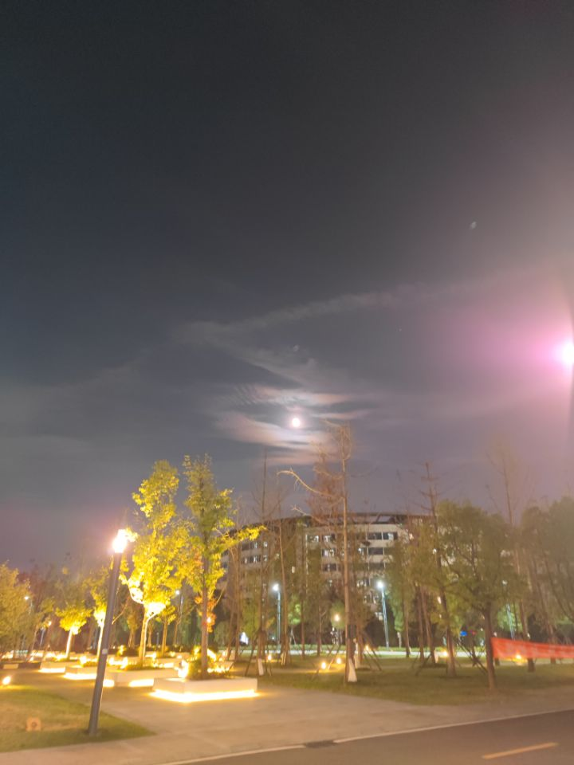

### 杂记or随想
'''
想在博客上记录一下自己的心情、想法，或者说是记录一下当时的自己的一些想法。感觉自己时而迷茫，时而好像有方向。乱七八糟，不知所言。
'''

#### 引言：虽然现在已经到了研究生阶段，但是会想起本科时的一个问题仍然会困扰我，到现在给不出一个答案。

花16周的时间听课、做题、复习、准备考试

与花一个复习周的时间准备考试

如果二者最终取得的结果一样

前者的努力还有意义吗？

好像我在努力的奋斗、生活，高中、大学、研究生，总想着下一个阶段会更好。

我好像活在未来，从不注意当下。

可是我发现，每当到了下一个阶段，生活好像也没有变得更好，我也没有更满意。

所以，当下即是生活？我不能跨越当下，去到未来，或者是理想的生活？

好像我做了很多努力，舍弃现在的生活，舍弃现在的享受，感觉享受会有愧疚，或者说有点分不清什么是享受，什么是奋斗，停下来就是偷懒吗？

我的生活真的与我努力有关吗？
我努力与否是否真的影响到了我的生活呢？
我的选择、我的努力真的对我的生活有改变吗？

是这样，我感觉我的努力、奋斗是为了得到更好的生活，如果二者没有因果关系，
我还要拼命的努力吗？
我的努力没有意义吗？
如果有意义，为什么我好像没有到达满意的生活呢？

#### 补：
这是9月份研究生开学半个月左右时的感想，现在是10月中旬，整理一下发到博客上。现在再看当时的这种感受，已经记不太清是因什么有感而发，好像是当时任务太多、事情太杂？另外现在也没有当时的心境，不过至少可以理解当时自己是时间安排的太紧觉得对未来有点迷茫，不知道当下的努力是否对未来有意义。

后来我也没有放弃寻找方向，在学术的方向上向着机器学习、人工智能努力，在生活上决定读一读儒家经典寻找下解决方案。希望我以后也能保持这种求知、好问的状态吧。